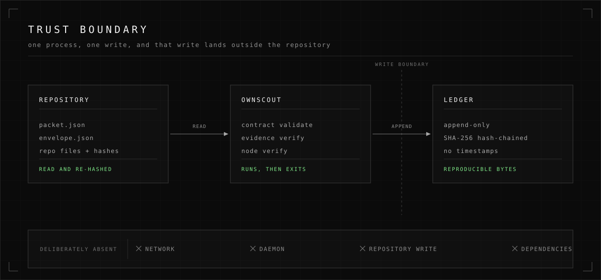
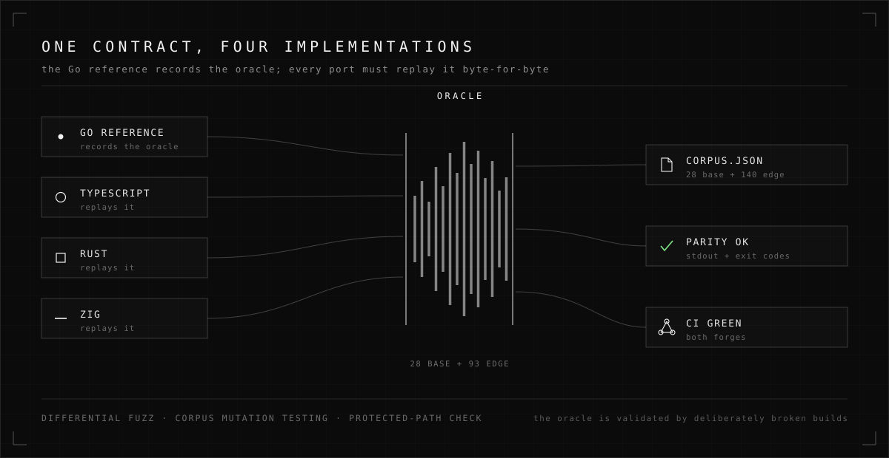
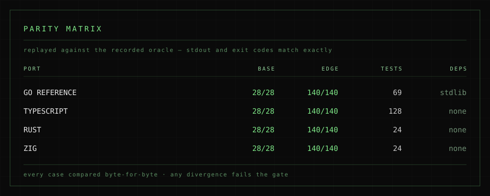

<p align="center">
  
</p>

<p align="center">
  <a href="#install"></a>
  <a href="#language-ports"></a>
  <a href="#language-ports"></a>
  <a href="#language-ports"></a>
  <br>
  <a href="#verification"></a>
  <a href="#verification"></a>
  <a href="#why-it-is-safe-to-run"></a>
  <a href="LICENSE"></a>
</p>

<h1 align="center">OwnScout</h1>

<p align="center"><strong>Know whether the evidence is still true — before you trust the work.</strong></p>

An autonomous agent says it is done. It hands you a packet: files touched, line
ranges, expected content hashes. But files change. Branches move. A hash that was
correct five minutes ago is now a lie.

**OwnScout** is a small, deterministic CLI that answers one question: *is this
evidence still current in this working tree, right now?* It validates the packet
against a strict contract, re-hashes the cited content, checks a dependency graph
of work items, and writes an append-only audit ledger. It never trusts the
producer's own claims.

## Contents

- [What it does](#what-it-does)
- [Install](#install)
- [Usage](#usage)
- [The JSON contract](#the-json-contract)
- [Exit codes](#exit-codes)
- [Why it is safe to run](#why-it-is-safe-to-run)
- [Language ports](#language-ports)
- [Verification](#verification)
- [Project layout](#project-layout)

## What it does

| Command | Question it answers |
|---|---|
| `ownscout doctor` | Is this installation healthy and what version is it? |
| `ownscout contract validate --packet p.json` | Is this packet well-formed and internally consistent? |
| `ownscout evidence verify --repo R --packet p.json` | Is the cited content still byte-identical in `R`? |
| `ownscout node verify --repo R --packet p.json --envelope e.json --ledger L` | Does the whole dependency graph check out, and what is the audit trail? |

Packet decoding is deliberately strict: unknown fields are rejected, duplicate
keys are rejected, trailing JSON is rejected, and there is a 1 MiB input limit.
There is no compatibility normalisation and no silent hash repair. **Fix the
packet, do not ask the tool to reinterpret it.**

## Install

OwnScout is a single static binary with no runtime dependencies.

```bash
git clone https://github.com/void-shell/ownscout
cd ownscout
make build            # -> bin/ownscout
bin/ownscout doctor
```

For a release build, inject the version:

```bash
go build -ldflags "-X ownscout/internal/cli.version=v0.1.0" -o bin/ownscout ./cmd/ownscout
```

## Usage

```bash
# Validate the packet contract alone.
ownscout contract validate --packet packet.json

# Verify that cited files still hash to the recorded values.
ownscout evidence verify --repo /path/to/repo --packet packet.json

# Same check, but a failure also reports where the content went.
ownscout evidence verify --repo /path/to/repo --packet packet.json --relocate

# Check a dependency graph and append the ordered results to a ledger.
ownscout node verify --repo /path/to/repo --packet packet.json \
  --envelope envelope.json --ledger /path/to/ownscout-ledger.jsonl
```

Add `--json` to any validation command for a single machine-readable line.
Use it in scripts and agents; omit it when a person is diagnosing a failure.

### When the evidence moved

A line range is a fragile way to cite code: insert a few lines above it and a
packet that was true five minutes ago now fails. `--relocate` searches the file
for a window of the same line count whose content hash matches the recorded one,
and names where it now lives:

```
- evidence "evidence-1" ("src/lib.rs"): content hash mismatch: expected a1b2…, got 9f8e…; content relocates to lines 140-150 (shift +40; nearest matching window)
```

It distinguishes three honest outcomes - the content moved, the content is not
in this file, or the search stopped at its budget - and it **never changes the
verdict**. A moved span still fails and the command still exits `1`, because
content that is no longer at the cited location is not current evidence. With
`--relocate` the failure simply tells you where to look.

### The safe workflow

Validate first, verify evidence second, and consume the packet only when both
succeed:

```bash
if ownscout contract validate --packet packet.json --json && \
   ownscout evidence verify --repo /path/to/repo --packet packet.json --json; then
  # The evidence is current; the packet may be consumed.
  :
else
  # Do not consume the packet.
  exit 1
fi
```

## The JSON contract

Every result has the same five fields, in this order:

```json
{
  "command": "contract validate",
  "ok": false,
  "summary": "packet is invalid (2 violation(s))",
  "details": [
    "required_field: evidence: required field is missing",
    "evidence: evidence: complete packet requires at least one evidence entry"
  ],
  "next_action": "Fix the listed packet fields, then run contract validation again."
}
```

Violation ordering is part of the contract. Fixing the first item in
`details` is always the right next move.

## Exit codes

| Code | Meaning |
|---|---|
| `0` | Success: valid packet, or verified evidence. |
| `1` | Contract failure, evidence failure, or node graph failure after a successful ledger append. |
| `2` | Usage error, malformed input, missing file, repository/ledger I/O, or ledger append failure. |

A `1` after `node verify` means *the graph did not pass*, but the results
were still recorded — the ledger is audit history, never an authorisation.

## Why it is safe to run

OwnScout is designed to be boring in exactly the ways that matter:

- **No network.** Nothing is fetched, phoned home, or uploaded.
- **No daemon.** It runs, it exits.
- **No repository mutation.** Evidence files are read and re-hashed, never written.
- **The only write** is the explicit `--ledger` file, which must live *outside*
  the repository, is append-only, hash-chained with SHA-256, and contains no
  timestamps, so its bytes are reproducible.
- **No dependencies.** Go standard library only; the ports have empty dependency
  manifests.

<p align="center">
  
</p>

## Language ports

This repository is also a study in **behavioural parity across languages**. The
Go implementation in `internal/` is the specification; three independent,
standard-library-only reimplementations reproduce its stdout, exit codes and
ledger bytes exactly.

<p align="center">
  
</p>

| Port | Binary | Build | Tests | Dependencies |
|---|---|---|---|---|
| TypeScript | `ports/ts/bin/ownscout` | none — Node 24 runs the source | 120 | none |
| Rust | `ports/rust/target/release/ownscout` | `cargo build --release` | 22 | none |
| Zig | `ports/zig/zig-out/bin/ownscout` | `zig build` | 21 | none |

Build the compiled ports and run everything:

```bash
make ports          # Rust + Zig binaries (TypeScript needs no build)
make ports-test     # each port's own test suite
spec/parity/verify-all.sh
```

The full guide is in [ports/README.md](ports/README.md); the contract every port
must satisfy is [spec/parity/PORT.md](spec/parity/PORT.md), and the recorded
status is [docs/PORTS.md](docs/PORTS.md).

## Verification

A port is only interesting if a passing grade means something. Here is how
parity is established.

<p align="center">
  
</p>

- **Recorded oracle.** The Go reference records 28 base cases and 120 hardening
  cases (path escape, non-UTF-8, graph cycles, ledger hash chaining, in-repo
  ledger rejection, JSON HTML-escaping, the null/empty field shapes, the
  raw-byte evidence shapes: invalid UTF-8 and CRLF in evidence files, a single
  empty selected line, and evidence files beyond 1 MiB, and the anchor
  re-resolution outcomes: moved, absent, shrunken file, and budget-stopped).
  Every port replays them byte-for-byte.
- **Mutation-tested oracle.** Four deliberately broken reference builds fail
  the corpora (base 26/28, 20/28, 28/28 and 28/28; edge 112/120, 64/120, 118/120
  and 118/120), so a pass is evidence, not a formality. The newest mutant strips
  the `\r` of a `\r\n` pair while leaving its `\n`, a divergence no base case can
  see, which is why the edge corpus exists.
- **Differential fuzzing.** `spec/parity/fuzz.py` mutates the fixtures and
  compares the reference against a candidate. It is what caught a real shared
  defect in all three ports: an explicit JSON `null` for `evidence` or
  `degradations` must count as *absent* for the required-field rule but still
  trigger the "complete packet requires at least one evidence entry" rule.
- **Protected paths.** The verifier fails if anything outside `ports/` is
  modified, so a port lane cannot quietly patch the oracle.

Run it yourself:

```bash
make gate                       # Go reference tests + corpus freshness
spec/parity/status.sh           # compact per-port status
python3 spec/parity/fuzz.py --candidate ports/zig/zig-out/bin/ownscout --iterations 300
```

## Project layout

```
cmd/ownscout/        CLI entry point
internal/
  cli/               command surface, rendering, exit codes
  contract/          packet-v1 validation and violation ordering
  evidence/          path-safe re-hashing of cited content, anchor re-resolution
  node/              node-envelope graph validation and evaluation
  nodepacket/        strict packet-v1 decoding
  ledger/            append-only SHA-256 hash-chained ledger
ports/
  ts/  rust/  zig/   independent reimplementations
plans/               design notes, including the DeltaDB primitive study
spec/
  parity/            the oracle: corpora, harness, verifier, fuzzer
specs/               packet-v1 and node-envelope-v1 documents
docs/
  assets/            the visuals used in this README
```

## License

[MIT](LICENSE) © Santiago Sainz
